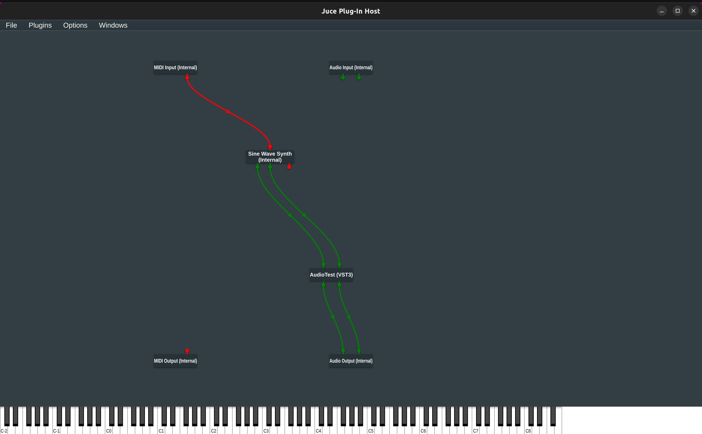

# plugin-test-1
Audio plugin using JUCE framework

### To build and run on Linux:
*Version of cmake used:* 3.31.2
- Run the initial cmake command to generate the build directory: cmake -S . -B build
    - Note that this will take a while since it will download JUCE and other stuff

- Build by running the following command cmake --build build

In order to run the standalone plugin, navigate to: build > plugin > PluginTest_artefacts > Standalone and run the AudioTest executable

**Tip:** for debugging purposes, there is the AudioPluginHost program inside JUCE/extras/AudioPluginHost.

This can be useful for testing changes. But in order to use the plugin we are writting with AudioPluginHost, we have to compile the plugin into All (instead of just standalone)

Easiest way to test changes: add a sine synth and connect the MIDI input node (red nodes on top of plugins) to it, and use the on-screen keyboard to play notes. Then obviously, connect the stereo outputs from the synth onto the plugin we are working on and we can hear any audio processing being made

Setup:

Note for Mac OS: To build program, run `xcodebuild` inside /AudioPluginHost/Builds/MacOSX.

You *have* to have xcode installed which annoys me so much but oh well

After building, executable is found in /MacOSX/build/Debug/AudioPluginHost.app/Contents/MacOS

---

## JUCE General Info
I've found kinda hard to find documentation in terms of the general knowledge of the framework (Components, Lifecycle, Architecture, etc).

Through some videos and external research I've found some useful info:

### Plugin Architecture
- *Audio Processor*: core class where audio processing happens. Important methods:
    - prepareToPlay: prepares the plugin for playback, allocate buffers
    - processBlock: process audio samples in real time. Seems like a "block" is how audio is represented, through AudioBuffer<float>
    - releaseResources: cleans up after playback

- *Audio Processor Editor*: manages the plugin's UI

### Audio Plugin Lifecycle
1. Plugin *loaded* by the DAW

    `AudioProcessor() // constructor`

2. Plugin *configured* by DAW

    `setStateInformation(const void* data, int sizeInBytes)`

3. Plugin given the *sampling rate* and *audio buffer size*

    `prepareToPlay(double sampleRate, int maxBufSize)`

4. Audio callback *generates audio* buffers in real time (constant audio input)

    `processBlock(AudioBuffer<float>&, MidiBuffer&) // many times`

5. Plugin told to *finish playing*

    `freeResources()`

6. DAW *Saves* Current Plugin State

    `getStateInformation(MemoryBlock& destData)`

7. DAW *Unloads* Plugin:

    `~AudioProcessor() // destructor`

### Audio Processing Concepts
- *Buffer Handling*: Audio data is passed as juce::AudioBuffer<float> or juce::AudioBuffer<double>. Data is processed per channel or sample

- *Sample Rate and Buffer Size*: The host dictates the sample rate and buffer size

### Misc Useful Concepts
- *AudioProcessorParameter*: use JUCE’s parameter classes (e.g., AudioParameterFloat) for creating automatable parameters.
- *ValueTree*: used to manage parameter state persistently and synchronously between the DSP and GUI.
- *Component*: Seems to be for GUI. Like a react component I'd imagine
    - Seems like these components would be added under the resized() function inside the PluginEditor class